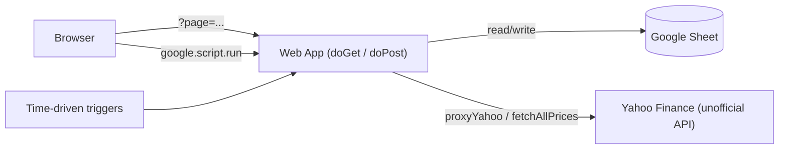

# TSE-YHO

A personal Tokyo Stock Exchange (TSE) portfolio tracker built as a single **Google Apps Script** web app. One deployment serves multiple HTML pages and a small JSON API, backed entirely by a Google Sheet (no external database).

## Pages

Single deployment, routed via `?page=` (defaults to `portfolio`). Every page shares the same nav bar.

| Page | File | URL (`?page=`) | Purpose |
|---|---|---|---|
| Portfolio | [`index.html`](index.html) | *(default)* | Add/edit/sell holdings, sector badges, tags, sector concentration warning |
| Growth | [`growth.html`](growth.html) | `growth` | Portfolio value over time, drawdown / all-time-high stats |
| History | [`history.html`](history.html) | `history` | Realized vs. unrealized P&L dashboard, sales ledger |
| Watchlist | [`watchlist.html`](watchlist.html) | `watchlist` | Stocks you're tracking but don't own yet, weekly price history |
| Calendar | [`calendar.html`](calendar.html) | `calendar` | Earnings / dividend / 優待 / custom key dates, optional Google Calendar sync |
| News | [`news.html`](news.html) | `news` | Headline digest for everything in your portfolio + watchlist |

## Backend

All server logic lives in [`Code.gs`](Code.gs):

- `doGet(e)` / `doPost(e)` — single entry point; serves HTML pages when no `action` param, otherwise dispatches JSON API calls (`list`, `add`, `edit`, `delete`, `sell`, `sales`, `yahoo`).
- `proxyYahoo(url)` / `fetchAllPrices(symbols)` — cached Yahoo Finance quote proxy, called from the client via `google.script.run`.
- `getYahooSession()` — cookie + crumb handshake required by Yahoo's `quoteSummary` endpoint (used by sector lookup and calendar events).
- Every CRUD operation (`editPosition`, `deletePosition`, `sellPosition`) resolves rows by a stable UUID (`findRowById`), never by client-computed row index.

## Google Sheet schema

The spreadsheet is the entire datastore. Each tab is created automatically on first use if it doesn't already exist.

### `Sheet1` — Portfolio (current holdings)

| Column | Type | Notes |
|---|---|---|
| `symbol` | string | e.g. `7203.T` |
| `name` | string | Company name |
| `buyPrice` | number | Weighted average cost |
| `buyDate` | date | Date of first/most recent buy |
| `shares` | number | Current share count |
| `notes` | string | Free text |
| `buyCount` | number | How many times you've bought into this position |
| `sector` | string | Auto-fetched from Yahoo (`assetProfile`), editable |
| `id` | string (UUID) | Stable row identifier — all CRUD keys off this, not position |
| `tag` | string | `long` / `swing` / `dividend` / `speculative` |

### `Sales` — realized trades

| Column | Type | Notes |
|---|---|---|
| `symbol`, `name` | string | |
| `buyPrice`, `sellPrice` | number | |
| `shares` | number | Shares sold in this transaction |
| `buyDate`, `sellDate` | date | |
| `profit` | number | `(sellPrice - buyPrice) * shares` |

### `Snapshots` — daily portfolio value history

Powers the Growth page. Backfilled by a daily trigger (`recordSnapshot`).

| Column | Type | Notes |
|---|---|---|
| `date` | date | One row per day (same-day re-runs update in place) |
| `invested` | number | Total cost basis that day |
| `value` | number | Total market value that day |
| `unrealizedPL` | number | `value - invested` |
| `plPct` | number | % return |
| `positions` | number | Number of open positions |

### `Watchlist` — stocks you don't own yet

| Column | Type | Notes |
|---|---|---|
| `symbol`, `name` | string | |
| `noticePrice` | number | Price when you added it |
| `noticeDate` | date | |
| `sector` | string | Auto-fetched |
| `notes` | string | |

### `WatchlistHistory` — weekly price snapshots for watchlist items

Backfilled by a weekly trigger (`recordWatchlistPrices`). Powers the mini price chart on the Watchlist page.

| Column | Type | Notes |
|---|---|---|
| `date` | date | |
| `symbol`, `name` | string | |
| `price` | number | Price that week |
| `noticePrice` | number | Copied from Watchlist at time of recording |
| `changePct` | number | % change vs. notice price |

### `KeyDates` — earnings / dividend / 優待 / custom events

Backfilled weekly for earnings + dividend dates (`fetchKeyDatesForPortfolio`); 優待 (shareholder benefits) and custom dates are added manually. Can optionally push events to Google Calendar.

| Column | Type | Notes |
|---|---|---|
| `symbol`, `name` | string | |
| `eventType` | string | `earnings` / `dividend` / `exdividend` / `yutai` / `custom` |
| `date` | date | |
| `note` | string | |
| `source` | string | `auto` (Yahoo) or `manual` |
| `calendarEventId` | string | Set if pushed to Google Calendar |

> **News** has no dedicated sheet — headlines are fetched live from Yahoo Finance and cached briefly (`CacheService`, ~1h TTL). Nothing is written to the spreadsheet.

## Time-driven triggers

None of these are required for the app to function, but each unlocks a feature. Set up from the Apps Script editor: **Triggers → + Add Trigger**.

| Function | Frequency | Enables |
|---|---|---|
| `recordSnapshot` | Daily, ~4–5pm (after TSE closes 3:30pm JST) | Growth page history |
| `recordWatchlistPrices` | Weekly, Monday ~9am | Watchlist price charts |
| `fetchKeyDatesForPortfolio` | Weekly, Monday ~6am | Auto-filled earnings/dividend dates |
| `sendNewsDigestEmail` | Daily, ~7am (before market open) | Morning news digest email |

## Setup

1. Create a Google Sheet and open **Extensions → Apps Script**.
2. Copy `Code.gs` and every `.html` file into the Apps Script project (or sync via a GitHub-connected editor extension).
3. **Deploy → New deployment → Web app**, execute as *Me*, access *Anyone*.
4. Open the deployed URL — sheets and headers are created automatically on first use.
5. (Optional) Add the time-driven triggers above for snapshots, watchlist history, key dates, and the news digest.
